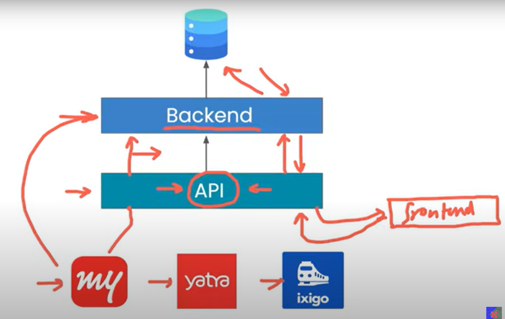
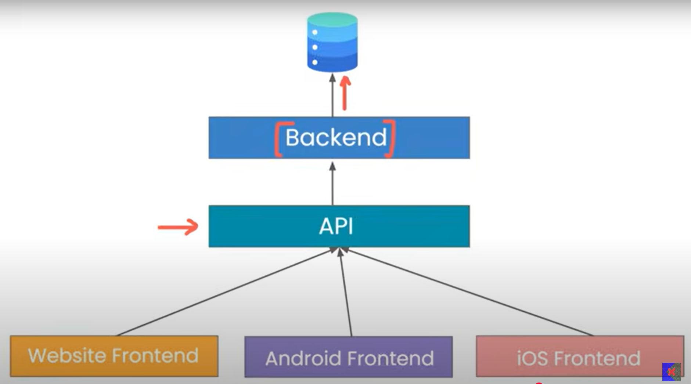

# APIs
### What are APIs ?    
API stands for Application Programming Interface.
It is a set of rules, protocols, and tools that allow two software applications to communicate with each other.

APIs standardize communication between frontend (apps, websites) and backend (server + database).

This way, the same backend can support multiple platforms (web, Android, iOS) without writing separate backend code for each. 

