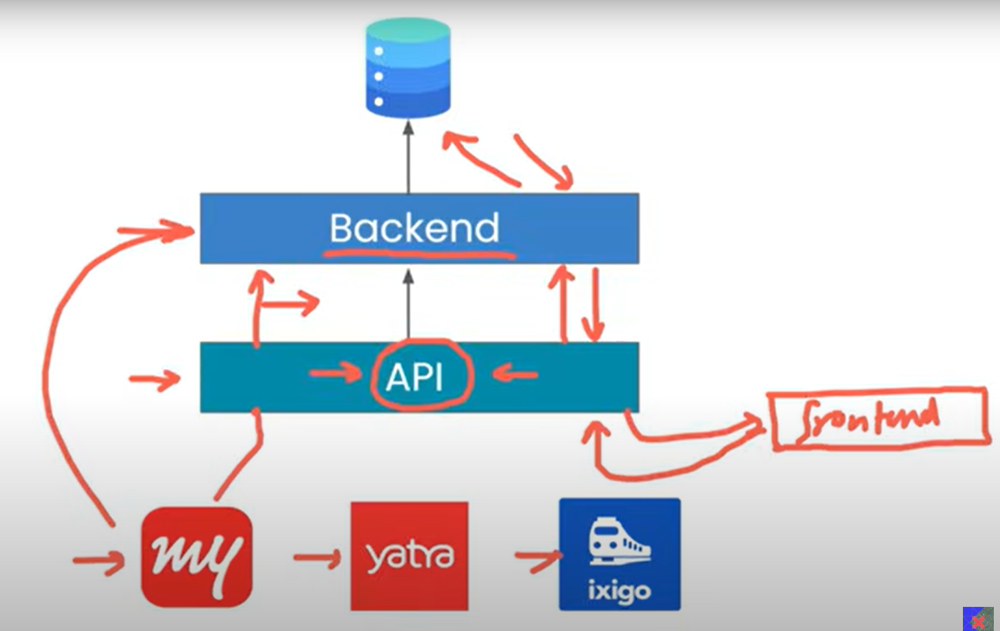
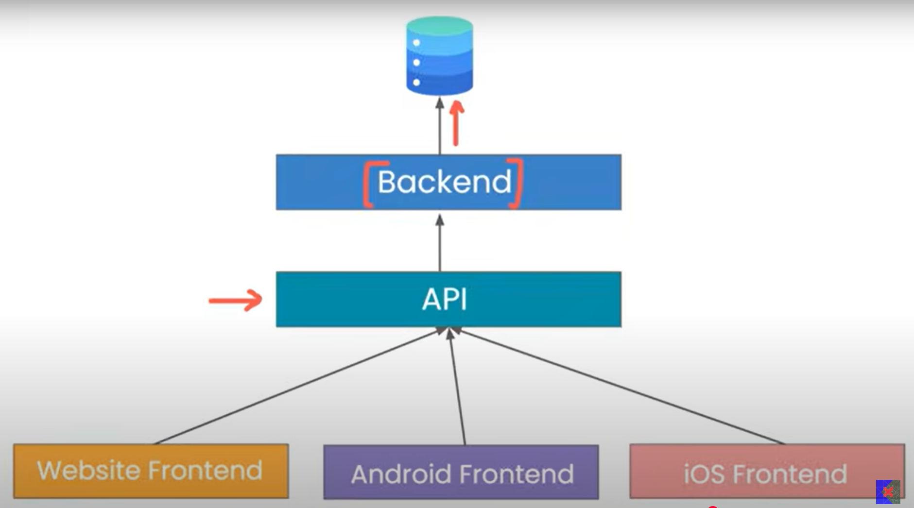
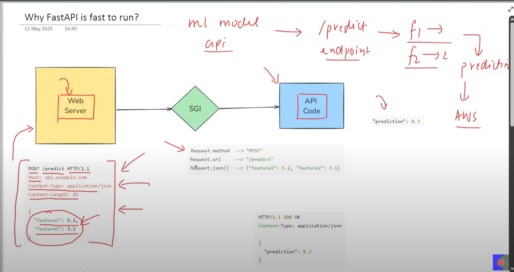
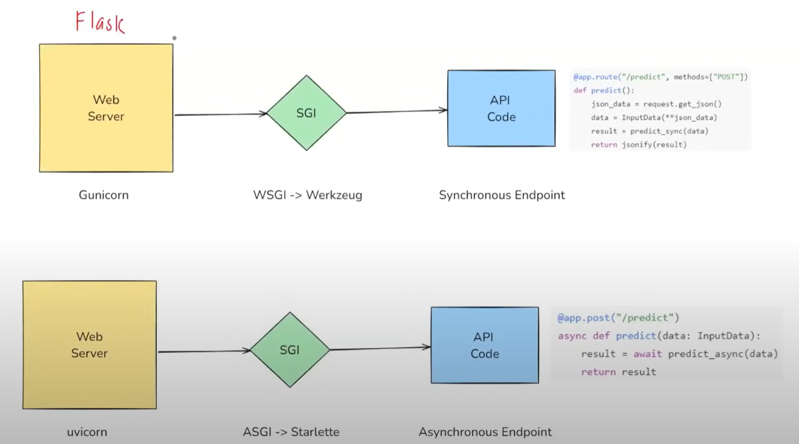

# APIs
### What are APIs ?    
API stands for Application Programming Interface.
It is a set of rules, protocols, and tools that allow two software applications to communicate with each other.

APIs standardize communication between frontend (apps, websites) and backend (server + database).

This way, the same backend can support multiple platforms (web, Android, iOS) without writing separate backend code for each.

---
### What are Ports (in Networking)?
A `port` is a number (between 0 and 65535) that helps a computer know which program/service should handle a network request.

---
### What are API endpoints ?
`API Endpoint` = a specific URL + HTTP method where your app provides a service. 

---

## FASTAPI
FastAPI is a modern, fast (high-performance), web framework for building APIs with Python.   
It is built on 2 python libraries :- 
- Starlette :- A lightweight ASGI (Asynchronous Server Gateway Interface) framework/toolkit used for building web applications.
FastAPI is built on top of Starlette for the web layer (routing, requests, responses).
-  Pydantic :- A library for data validation, parsing, and settings management using Python type hints.
FastAPI uses Pydantic to make sure input/output data is valid and structured.

`Type hints` (a.k.a. type annotations) tell what kind of data a variable, function argument, or return value should have.

When we say we deployed our API application that means we essentially sent our API code and web server on the cloud.

A `web server` is software (sometimes combined with hardware) whose main job is to receive requests from clients (like browsers or apps) and send back responses (like HTML, JSON, images, etc.).

When you run an API with FastAPI + Uvicorn, Uvicorn is your web server.

### 1️. Why do we need SGI (Server Gateway Interface)?
- A client/browser sends requests in HTTP format (raw network stuff).
- Python apps can’t directly understand network requests.
- Web servers (like Uvicorn, Gunicorn) understand HTTP but don’t know Python logic.
- SGI is the translator between server ↔ Python app.
- Without SGI, your Python code wouldn’t know what to do with an HTTP request.

`WSGI` stands for Web Server Gateway Interface.    
- It is a standard for connecting Python web applications to web servers.    
- WSGI is synchronous.    
- Each worker handles one request at a time.
- While a request is being processed, the worker is blocked and cannot process another request.
- Blocking means the server must wait for the current task (like reading a file or database query) to finish before moving to the next one.
- Suitable for simple or low-traffic applications.
- Becomes slow when handling many requests or tasks that need concurrency (e.g., chat, streaming, long connections).   

`ASGI` stands for Asynchronous Server Gateway Interface.
- It is the successor to WSGI, designed for modern Python web applications.
- ASGI is asynchronous.
- A worker can handle multiple requests at the same time.
- While waiting on a slow task (like database or network call), the worker is not blocked.
- Non-blocking means the worker can switch to another request while the first one is still waiting.
- Suitable for high-traffic applications and real-time features like chat apps, notifications, or streaming.
- Provides support for both HTTP and WebSockets (unlike WSGI, which only supports HTTP).

### So the reason for FASTAPIs being fast is because components are asynchronous .

