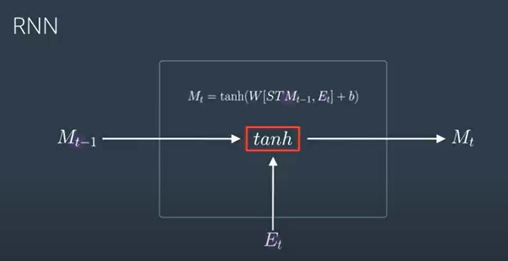
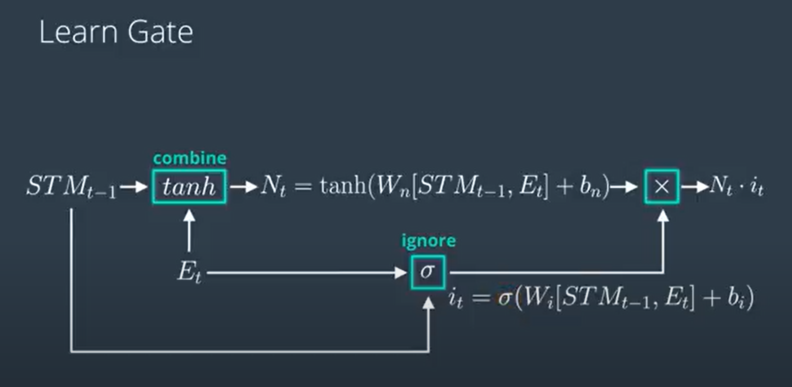
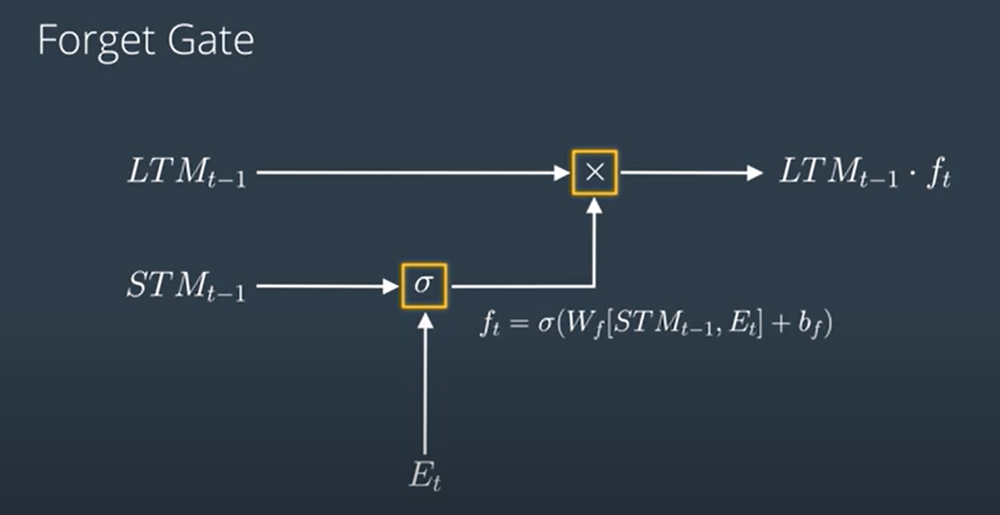
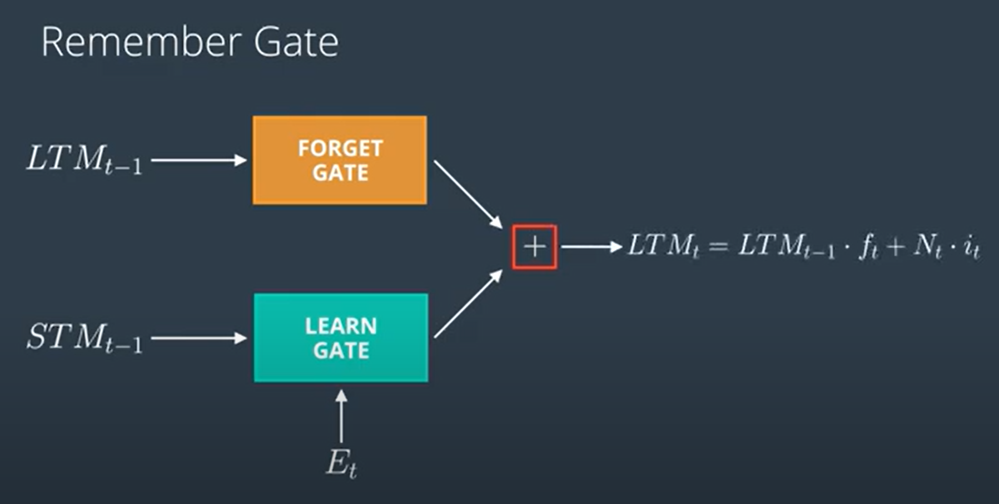
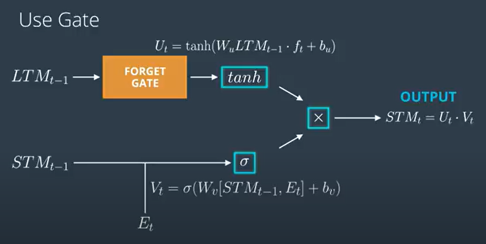
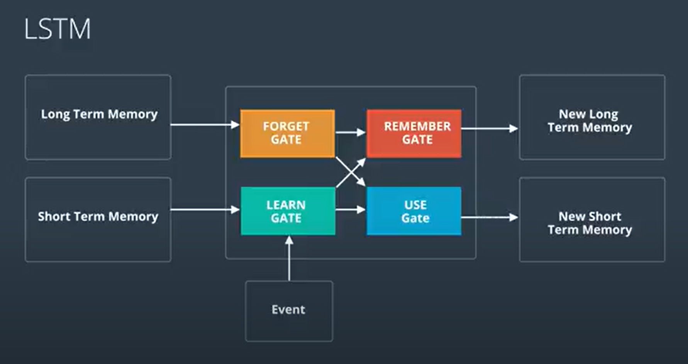

# Recurrent Neural Network

### What are Recurrent Neural Networks? 
**Definition**: Recurrent Neural Networks (RNNs) are a class of neural networks designed for processing sequential data. They are particularly effective for tasks where the order of the data matters, such as time series analysis, natural language processing, and speech recognition.

**Architecture**: RNNs have a unique architecture that allows them to maintain a hidden state that captures information from previous time steps. This hidden state is updated at each time step based on the current input and the previous hidden state.

**Key Features:**

- Memory: RNNs can remember information from previous inputs, making them suitable for tasks where context is important.
- Sequential Processing: They process sequences of data one element at a time, updating their hidden state with each new input.

**Applications:**
- Time Series Prediction: Useful for forecasting future values based on historical data.

**Limitations:**

- Vanishing Gradient Problem: RNNs can struggle to learn long-range dependencies due to gradients diminishing over time, making it difficult to capture information from earlier time steps.

**Vanishing Gradient Problem:**
The vanishing gradient problem occurs when the gradients (used to update the weights during training) become very small as they are propagated backward through the layers of the network. This can lead to very slow learning or even prevent the network from learning altogether.

##  LSTM (Long Short Term Memory)

LSTM is a type of Recurrent Neural Network (RNN) designed to better capture long-range dependencies in sequential data. It addresses the vanishing gradient problem commonly faced by traditional RNNs.

**Memory Components:**

**Short-Term Memory:** This refers to the immediate context or recent inputs that the LSTM can quickly access.
**Long-Term Memory:** This refers to the information that the LSTM retains over longer sequences, allowing it to remember important details from earlier in the sequence.

**Architecture:**  
It has 4 gates :-
- Learn Gate
- Forget gate
- Remember Gate
- Use Gate

1.**Learn Gate**  
The Learn Gate is responsible for determining how much new information to add to the cell state based on the current input and the previous short-term memory.  

 **Components:**
- Short-Term Memory (STM): Represents the information carried from the previous time step.
- Current Input (Event): The new information that needs to be integrated into the memory.
  
The Learn Gate combines the short-term memory and the current input to create a new candidate memory.  
It uses a linear transformation followed by a non-linear activation function (often tanh) to generate this new information.  
The output of the Learn Gate is then multiplied by an ignore factor to determine which parts of the new information to keep and which to discard.   

Output will be addded to cell state.

2.Forget gate:  
This gate forgets some part of long term memory by multiplying it with forgetting factor. 

3.Remember Gate
This gate updates the long term memory.

4.Use Gate  
This gate updates the short term memory.

The final architecture of LSTM is as follows:- 

---