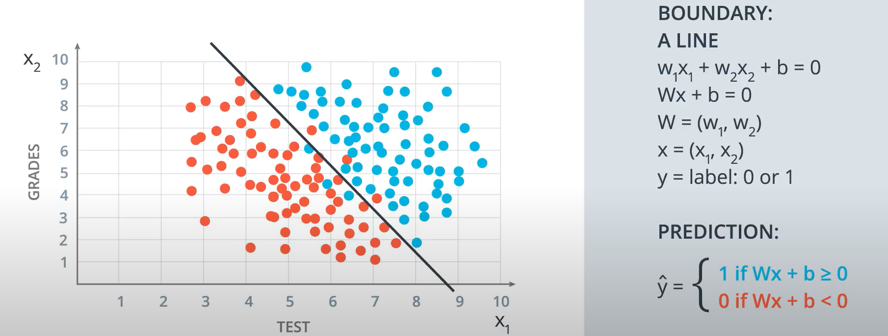
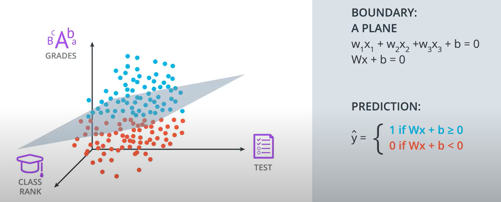
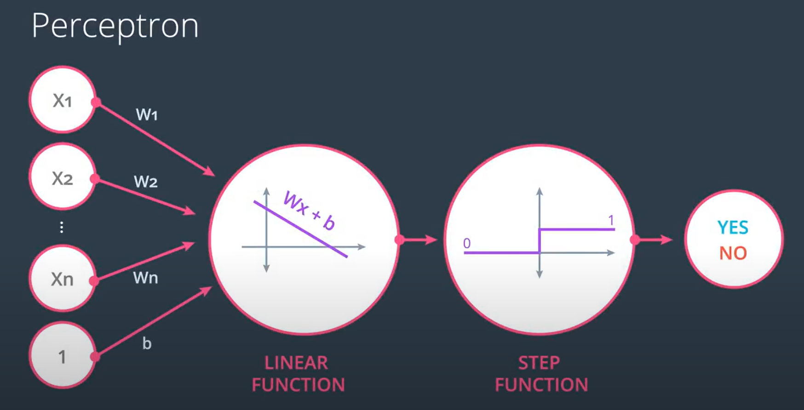

# Introduction to Neural Network
---
### What are Neural Networks ?
>They are a class of ML models inspired from the structure and design of human brain.They are designed for recognizing patterns,make predictions and take decisions based on data.

### Structure of Neural Networks (NN)
1.**Neurons** :- They are the basic building blocks of NN. They receive the data,processes it and produces output.  

2.**Layers**:  
- Input Layer :- This is the first layer which receives the input. Each neuron in the layer represents a feature of the input.
- Hidden Layers :- These are the layers between input and output layer(1 or many).If there are more than 1 hidden layers then we call NN as Deep NN. They have multiply neurons. The hidden layers perform computations and extract features from the input data.  
- **Output Layer** :- This is the final layer that produces the output of the network.  
  
3.**Weights and Biases** :-  
**Weights** :- 
- Def:-Each connection between neurons has an associated weight, which determines the strength of the connection. Weights are parameters within the neural network that are adjusted during training. They determine the strength of the connection between neurons in different layers.  
- Functions:-
 Each input feature is multiplied by a weight before being passed to the next layer. The weight indicates how much influence that particular input has on the neuron's output. A higher weight means that the input has a greater impact on the output.  

**Biases** :-   
- Def:-Bias is like a constant that helps the model make better predictions by shifting the output of a neuron.(like a offset).
- Functions:- The bias is added to the weighted sum of inputs before applying the activation function. It acts as an offset, allowing the activation function to shift to the left or right, which can help the model fit the data better.

### What are is a activation function ?
It is a mathematical function that generates the output of each neuron. It introduces non-linearity, helping the network learn complex patterns beyond just straight lines.

--- 
### Line boundaries
A line boundary is a straight line or hyperplane(in higher dimensions) that seperates different classes in a dataset.

Here W:weight , x:input , y:label/output , b:bias

Now if we start working with (n\*1) dimentional input features the straight line will be replaced with a n-dimensional plane.We will have (1*n) dimension weight vector and (1\*1) dimension bias.

---
### Perceptrons
A perceptron is one of the simplest types of artificial neural networks and serves as a fundamental building block for more complex neural network architectures.
It consists of a single neuron that takes multiple inputs, applies weights to them, and produces a binary output.   

