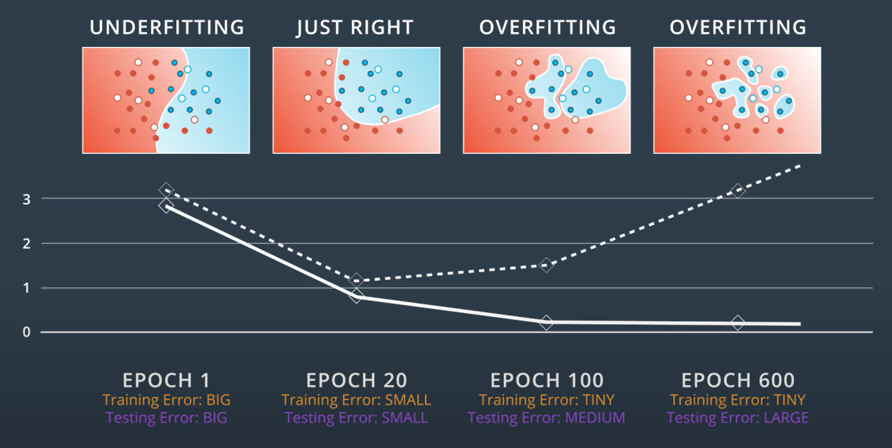

# Introduction to Neural Network
---
### What are Neural Networks ?
>They are a class of ML models inspired from the structure and design of human brain.They are designed for recognizing patterns,make predictions and take decisions based on data.

### Structure of Neural Networks (NN)
1.**Neurons** :- They are the basic building blocks of NN. They receive the data,processes it and produces output.  

2.**Layers**:  
- Input Layer :- This is the first layer which receives the input. Each neuron in the layer represents a feature of the input.
- Hidden Layers :- These are the layers between input and output layer(1 or many).If there are more than 1 hidden layers then we call NN as Deep NN. They have multiply neurons. The hidden layers perform computations and extract features from the input data.  
- **Output Layer** :- This is the final layer that produces the output of the network.  
  
3.**Weights and Biases** :-  
**Weights** :- 
- Def:-Each connection between neurons has an associated weight, which determines the strength of the connection. Weights are parameters within the neural network that are adjusted during training. They determine the strength of the connection between neurons in different layers.  
- Functions:-
 Each input feature is multiplied by a weight before being passed to the next layer. The weight indicates how much influence that particular input has on the neuron's output. A higher weight means that the input has a greater impact on the output.  

**Biases** :-   
- Def:-Bias is like a constant that helps the model make better predictions by shifting the output of a neuron.(like a offset).
- Functions:- The bias is added to the weighted sum of inputs before applying the activation function. It acts as an offset, allowing the activation function to shift to the left or right, which can help the model fit the data better.

### What are is a activation function ?
It is a mathematical function that generates the output of each neuron. It introduces non-linearity, helping the network learn complex patterns beyond just straight lines.

--- 
### Line boundaries
A line boundary is a straight line or hyperplane(in higher dimensions) that seperates different classes in a dataset.

Here W:weight , x:input , y:label/output , b:bias

Now if we start working with (n\*1) dimentional input features the straight line will be replaced with a n-dimensional plane.We will have (1*n) dimension weight vector and (1\*1) dimension bias.

---
### Perceptrons
A perceptron is one of the simplest types of artificial neural networks and serves as a fundamental building block for more complex neural network architectures.
It consists of a single neuron that takes multiple inputs, applies weights to them, and produces a binary output.   

### Error Function
an error function (or loss function) measures how well your model's predictions match the actual data.

--- 

### Discrete and Continuous Predictions
**Discrete Prediction** :- Predictions that result in distinct categories or classes (e.g., yes/no, accepted/rejected).
**Continuous Predictions** :- Predictions that yield a range of values, usually between 0 and 1, representing probabilities.  

  

**Signoid Function** :-  
It's mathematical function that maps any real-valued number into the range between 0 and 1.  
- *Larger positive numbers are mapped closer to 1*
- *Smaller negative numbers are mapped closer to 0*
- *0 is mapped to 0.5*

### Multi-Class Classification and Softmax
**Softmax Function** :-  
The Softmax function is an activation function that converts a vector of raw scores into probabilities. It is commonly used in multi-class classification problems.

  

### One-Hot encoding  
Machine learning algorithms require numerical input. Categorical data, such as classes or labels, must be converted into numbers.  
For binary categories (e.g., received a gift or not), a simple encoding can be used: 1 for received and 0 for not received.
One-hot encoding creates a binary column for each class.  
For example:
Duck: [1, 0, 0] ,
Beaver: [0, 1, 0] , 
Walrus: [0, 0, 1]

### Cross Entropy  
 There is a connection between probabilities and error functions, and it's called Cross-Entropy.
In machine learning, it helps us understand how well our model's predicted probabilities match the actual outcomes.  
Use cross-entropy when you're working on classification tasks, especially when you have multiple classes (like identifying different types of animals in images).
>sum of all (-ln(probabilities))   

*Good* Model has lower cross entropy and *Bad* model has higher cross entropy.

### Error function

  

For multi-class models we have:- 

  
### Logistic Regression  
The Logistic Regression Algorithm. And it basically goes like this:

- Take your data
- Pick a random model
- Calculate the error
- Minimize the error, and obtain a better model

### Gradient Descent

### FeedForward
Feedforward is the process neural networks use to turn the input into an output.It involves passing the input through the network layers to generate predictions.
  

### BackPropagation
 Backpropagation is an algorithm used to train artificial neural networks by minimizing the error between predicted outputs and actual outputs. It efficiently computes the gradient of the loss function with respect to each weight in the network.

**Process**:

- Feedforward: Input data is passed through the network, and predictions are made.

- Calculate Loss: The error (loss) is computed using a loss function (e.g., cross-entropy for classification).

- Compute Gradients: The algorithm calculates the gradient of the loss with respect to each weight by applying the chain rule of calculus. This involves:

    - Calculating the derivative of the loss with respect to the output of the network.
    - Propagating this error backward through the network layers to compute gradients for each weight.
- Update Weights: The weights are updated using an optimization algorithm (e.g., gradient descent) to minimize the loss
--- 
### Types of errors
- Underfitting :- Here model is too simple to capture the underlying trend of the data. This results in poor performance on both the training and validation/test sets. 
- Overfitting :- Here model is too complex that capturing noise and outliers instead of the underlying pattern. This results in high accuracy on the training set but poor generalization to new, unseen data.  
>If we are to choose an architecture for our need we must try to choose just right or more complex model and then try to apply some techniques for avoiding overfitting.
---
### Early Stopping

As we train our model on the training set, it tries to minimize the error by adjusting its parameters to fit the training data as closely as possible.
However, if the model becomes too focused on fitting the training data perfectly, it starts to memorize rather than learn general patterns.
As a result, when we evaluate the model on the test set (unseen data), its performance may degrade, and the error increases.
This is because the model fails to generalize to new inputs — it has overfit to the noise or specific details of the training data.

*Early stopping* is a regularization technique used to prevent overfitting in machine learning models, particularly neural networks. It involves monitoring the model's performance on a validation set during training and stopping the training process when performance starts to degrade.
  

During training, we monitor the error (or loss) on both the training set and a validation set (a small portion of data not used for training but also not completely unseen like the test set).
Initially, both training and validation errors decrease. But after a certain point, the validation error starts to increase while training error continues to decrease.
This signals that the model is starting to overfit the training data.

---
## Regularization

**Definition**: Regularization is a technique used in machine learning to prevent overfitting by adding a penalty to the loss function. It helps to ensure that the model generalizes well to unseen data.

**Purpose**: The main goal of regularization is to reduce model complexity, which can lead to better performance on validation and test datasets.

**L1 Regularization** adds the absolute value of weights to the loss function:

Loss=Original Loss+𝜆∑∣𝑤∣

- Encourages sparsity (some weights become exactly zero).

- Helps in feature selection.

**L2 Regularization** adds the squared value of weights:

Loss=Original Loss+𝜆∑𝑤^2

- Penalizes large weights more heavily than small ones.

- Helps in keeping the model smooth and generalizable.

###  DropOut
 Dropout is a regularization technique used in neural networks to prevent overfitting during training. It involves randomly "dropping out" (setting to zero) a fraction of the neurons in the network during each training iteration.

**How It Works**:

- During training, for each forward pass, a specified percentage of neurons (e.g., 20% or 50%) are randomly selected and temporarily removed from the network.
- This means that those neurons do not contribute to the forward pass or the backpropagation step for that iteration.
- The remaining neurons must learn to compensate for the dropped-out neurons, promoting redundancy and robustness in the network.

### ReLU (Activation Function)
 ReLU is an activation function used in neural networks that outputs the input directly if it is positive; otherwise, it outputs zero. 

### Batch Gradient Descent
**Definition**: Batch gradient descent computes the gradient of the loss function using the entire training dataset. It updates the model parameters only once per epoch.  
**Disadvantages**:
Memory-intensive: Requires loading the entire dataset into memory, which can be impractical for large datasets.
Slow updates: Can take longer to converge since it updates parameters only once per epoch.

### Stochastic Gradient Descent (SGD)
**Definition**: Stochastic gradient descent updates the model parameters using only one subset of training dataset at a time. This means that the gradient is computed and the parameters are updated for each individual training example.  
**Advantages**:
Faster updates: Parameters are updated more frequently, which can lead to faster convergence.
Less memory-intensive: Only one training example is needed at a time, making it suitable for large datasets.

### Learning Rates
- Higher learning rates can cause the model to overshoot the optimal point or even diverge.
→ The loss may never converge or keep oscillating.

- Smaller learning rates make training slower, but they allow the model to converge more precisely, increasing the chance of reaching or getting very close to the global minimum.

- Ideal strategy:
Start with a higher learning rate to make fast progress initially, and then gradually reduce it as the model approaches the minimum.

### Momentum  
**Definition**: Momentum is an optimization technique used in gradient descent to accelerate convergence and improve the stability of the training process. It helps to overcome issues like local minima and oscillations.

**Concept**: The idea behind momentum is to maintain a velocity vector that accumulates the gradients of past iterations. This velocity helps to push the parameters in the relevant direction, smoothing out updates.

Here we can see, the far away steps are multiplied by higher powers of beta and beta is between 0 to 1, hence higher powers means smaller value (less important/contribution).
